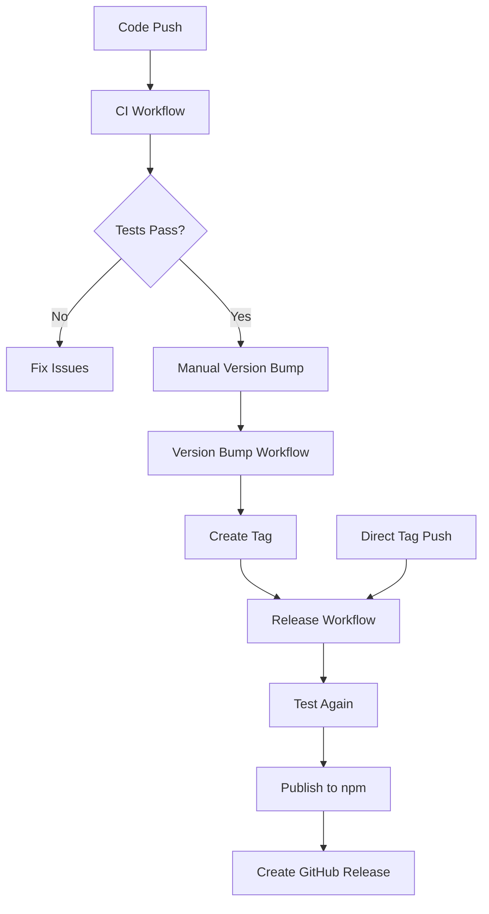

# GitHub Actions Workflow Configuration

Technical guide for setting up automated release workflows for `istanbul-middleware-ts`.

## 📁 Workflow Architecture

```
.github/workflows/
├── ci.yml           # Continuous Integration
├── release.yml      # Automated Publishing
└── version-bump.yml # Version Management

scripts/
├── release.sh       # Interactive Release
└── setup-release.sh # Environment Validation
```

## 🔧 Initial Setup

### 1. npm Token Configuration

1. Create **Automation Token** at [npmjs.com](https://www.npmjs.com/settings/tokens)
2. Add to GitHub repository secrets:
   - **Settings** → **Secrets and variables** → **Actions**
   - **Name**: `NPM_TOKEN`
   - **Value**: `your-token-here`

### 2. Workflow Permissions

Ensure repository has proper permissions:

- **Settings** → **Actions** → **General**
- **Workflow permissions**: Read and write permissions
- **Allow GitHub Actions to create and approve pull requests**: ✅

## 📋 Workflow Details

### CI Workflow (`ci.yml`)

**Triggers**: Push to `main`/`develop`, Pull Requests

**Matrix Testing**:

- Node.js versions: 18, 20, 21
- Operating system: ubuntu-latest

**Steps**:

1. Checkout code
2. Setup Node.js with npm cache
3. Install dependencies (`npm ci`)
4. TypeScript compilation (`npm run build`)
5. Run tests (`npm test --if-present`)
6. Server functionality test
7. Security audit (`npm audit`)
8. Package validation (`npm pack --dry-run`)

### Release Workflow (`release.yml`)

**Triggers**: Tags matching `v*` pattern (e.g., `v1.0.0`)

**Jobs**:

1. **Test Job**: Same as CI workflow
2. **Publish Job**:
   - Build package
   - Validate contents
   - Publish to npm registry
3. **Release Job**:
   - Create GitHub Release
   - Generate release notes

### Version Bump Workflow (`version-bump.yml`)

**Trigger**: Manual dispatch with parameters

**Inputs**:

- `version_type`: patch, minor, major, prerelease
- `prerelease_tag`: beta, alpha, rc (for prereleases)

**Process**:

1. Bump version in `package.json`
2. Update `CHANGELOG.md`
3. Commit changes
4. Create and push tag
5. Trigger release workflow

## 🔄 Automation Flow



## ⚙️ Configuration Files

### package.json Scripts

```json
{
  "scripts": {
    "preversion": "npm run build",
    "postversion": "git push && git push --tags",
    "release": "./scripts/release.sh",
    "release:patch": "npm version patch && npm publish",
    "release:minor": "npm version minor && npm publish",
    "release:major": "npm version major && npm publish",
    "release:beta": "npm version prerelease --preid=beta && npm publish --tag beta"
  }
}
```

### Environment Variables

**GitHub Actions Environment**:

- `NPM_TOKEN`: npm authentication
- `GITHUB_TOKEN`: Auto-provided by GitHub

**Local Development**:

- `PORT`: Test server port (default: 3000)
- `COVERAGE`: Enable coverage (default: true)

## 🔍 Monitoring & Debugging

### GitHub Actions Logs

Access detailed logs:

1. **Repository** → **Actions** tab
2. Select workflow run
3. Expand job steps for details

### Common Debug Commands

```bash
# Validate workflow syntax
npx github-actions-validator .github/workflows/

# Test package locally
npm pack --dry-run
npm publish --dry-run

# Check npm configuration
npm config list
npm whoami
```

### Workflow Debugging

Add debug steps to workflows:

```yaml
- name: Debug Environment
  run: |
    echo "Node version: $(node --version)"
    echo "npm version: $(npm --version)"
    echo "Current directory: $(pwd)"
    echo "Files: $(ls -la)"
```

## 🛡️ Security Considerations

### Token Security

- Use **Automation tokens** (not Classic tokens)
- Rotate tokens regularly
- Monitor token usage in npm dashboard

### Workflow Security

- Pin action versions (`uses: actions/checkout@v4`)
- Review third-party actions
- Use `needs` to control job dependencies

### Branch Protection

- Require PR reviews for `main` branch
- Require status checks to pass
- Restrict push to `main` branch

## 📊 Performance Optimization

### Caching Strategy

- npm cache: `cache: 'npm'` in setup-node
- Dependencies: `npm ci` instead of `npm install`
- Build artifacts: Cache between jobs if needed

### Parallel Execution

- Matrix builds run in parallel
- Independent jobs run concurrently
- Use `needs` only when necessary

## 🔧 Customization

### Adding New Workflows

1. Create `.github/workflows/new-workflow.yml`
2. Define triggers and jobs
3. Test with repository dispatch or manual trigger

### Modifying Existing Workflows

1. Edit workflow files
2. Test changes on feature branch
3. Monitor workflow runs after merge

### Custom Scripts

Add new scripts to `scripts/` directory:

- Make executable: `chmod +x scripts/new-script.sh`
- Add to package.json scripts if needed
- Document usage in README

## 📚 Advanced Topics

### Multi-package Publishing

- Use `lerna` or `rush` for monorepos
- Configure separate workflows per package
- Use path filters in workflow triggers

### Cross-platform Testing

- Add Windows and macOS to matrix
- Handle path differences
- Test platform-specific features

### Integration Testing

- Add end-to-end tests
- Test actual npm installation
- Verify TypeScript types work

For release operations, see [Release Guide](./RELEASE.md).
